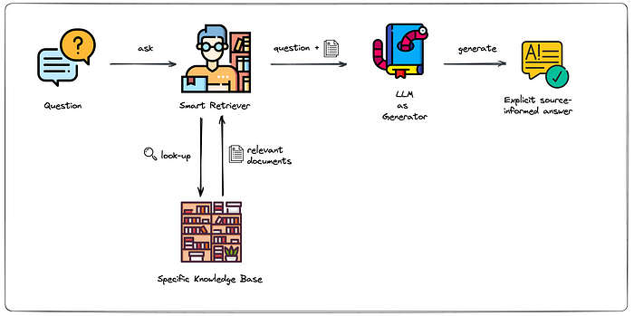

# AI PDF Reader

This project focuses on data extraction from a PDF file with AI. In this case, we will use the [2023 Apple's Form 10-K](https://s2.q4cdn.com/470004039/files/doc_earnings/2023/q4/filing/_10-K-Q4-2023-As-Filed.pdf).

Given a company's proprietary files, we want to have a quick query system from those files. A system similar to having a secretary. The technology we will use is called Retrieval Augmented Generation (RAG). 

### What is RAG?

RAG is the process of optimizing a large language model (LLM) so that it utilizes user-provided data not present in the model's training data before generating a response. LLMs are trained on large volumes of data and use billions of parameters to produce original outputs in tasks such as answering questions, translating languages, and completing sentences. A RAG extends the already powerful capabilities of LLMs to specific domains or an organization's internal knowledge base, all without the need to retrain the model. This method is a cost-effective way to enhance the results of LLMs so they remain relevant, accurate, and useful across various contexts.

A RAG offers several direct benefits in the development of an artificial intelligence tool:

+ **Cost-effectiveness of implementation**. AI development typically begins with a basic model. Foundational Models (FMs) are API-accessible LLMs trained on a broad spectrum of generalized and unlabeled data. The computational and financial costs of retraining FMs to include specific organizational or domain-specific information are very high. A RAG is a more cost-effective approach to introducing new data into the LLM.

+ **Updated information**. Even if the LLM is trained with data that suits a company's needs, maintaining the model's relevance is challenging. A RAG allows developers to provide the latest research, statistics, or news to generative models. A RAG can be used to connect the LLM directly to live social media feeds, news sites, or other frequently updated information sources. This way, an LLM can offer the most up-to-date information.

+ **Trust**. By feeding the LLM its own data, the data source is well-known, and it avoids the LLM's hallucination.

+ **Greater control**. RAG enables AI developers to switch information sources to adapt to changing requirements or the company's multiple uses. They can also restrict the retrieval of sensitive information to different levels of authorization and ensure that the LLM generates appropriate responses.

The general RAG scheme is as follows:

### How RAG works?

1. The company's documents are processed through an embedding model to be stored as vectors in a database.

2. The query made by the user goes through the same model to convert the text into vectors.

3. The most similar vectors to the query are searched for in the database, and the most relevant vectors are extracted.

4. The most relevant documents extracted and the query are input into the LLM to generate the most appropriate response.

### RAG Building

First, we need to transform the PDFs. Since the context of an LLM is limited in tokens, and given that files are usually large in terms of text, the PDFs will be "chunked" to be stored in the database. A "chunk" generally refers to a part or segment of text that has been extracted from a larger file for use in the text generation process. This term can be especially relevant when discussing how documents or data are divided into more manageable parts before being used to enhance the responses generated by a LLM. By using chunks, the RAG system can search the database more efficiently to find the most relevant and useful text segments related to the user's query. Chunks are stores in a vector database after being embedded.

Embedding models are a type of machine learning approach used to convert raw data, such as text, into a numerical form where similar items are represented by points that are close to each other in a high-dimensional space. Basically, embedding models transform text into numerical vectors. We must remember that machines do not understand words, only numbers. Once we have the vectors, we create the vector database.

With the database created, we can use our query to search the relevant chunks, using both, query and chunks as context, as input to the LLM to obtain the best possible response.

### Technologies used

+ [LangChain](https://www.langchain.com/)
+ [OpenAI GPT4](https://openai.com/)
